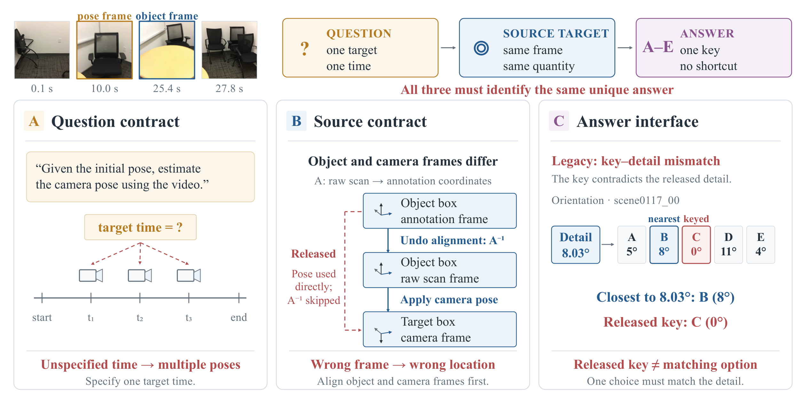
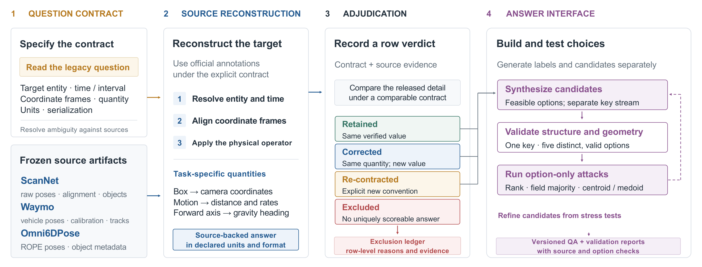
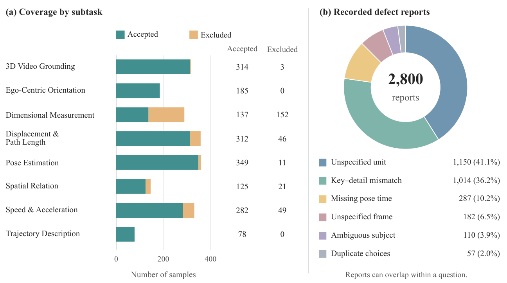
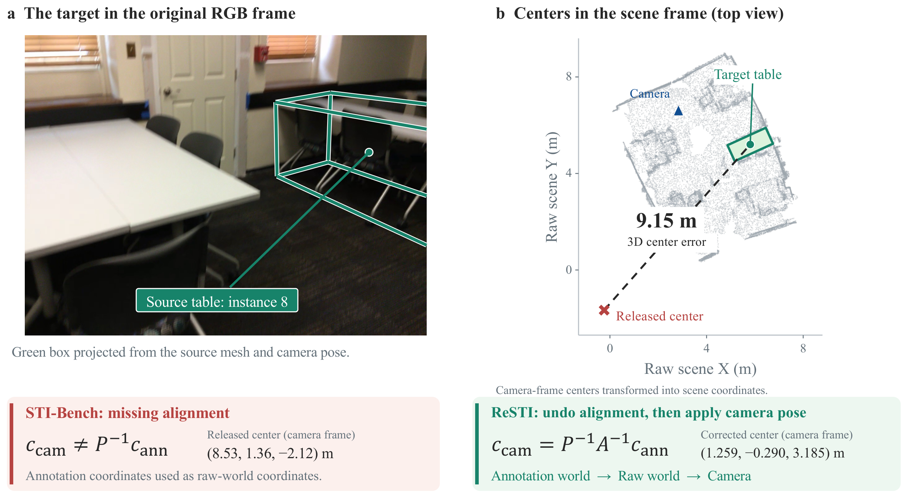
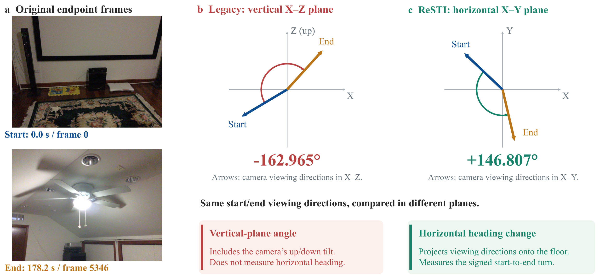

# ReSTI: A Source-Grounded Audit and Repair of STI-Bench

**1,782 accepted questions · 282 documented exclusions · 8 tasks · 3 source datasets**

[Paper](https://github.com/pengzhansun/ReSTI-Technical-Report/blob/main/main.pdf) ·
[Parquet annotations](annotations/resti.parquet) ·
[JSONL annotations](annotations/resti.jsonl) ·
[Exclusion records](annotations/excluded.jsonl) ·
[Data format](docs/data_format.md)

ReSTI audits STI-Bench against its source annotations and repairs questions,
geometric targets, and answer choices. It reconstructs recoverable answers
under explicit entities, times, coordinate frames, physical quantities, and
units. Every one of the 2,064 original questions is accounted for as an accepted
question or a documented exclusion.

This repository provides the **ReSTI v5 annotation release** used in our report.
The filenames have been simplified; the annotation files are byte-for-byte
identical to the August 15, 2026 release. This is a packaging update, not a new
dataset revision. See [release provenance](docs/release.md).



## Download and use

```sh
git clone https://github.com/pengzhansun/ReSTI.git
cd ReSTI
```

The annotations are small enough for ordinary Git; Git LFS is not required.
Read the complete accepted set without additional Python packages:

```python
import json
from pathlib import Path

with Path("annotations/resti.jsonl").open(encoding="utf-8") as f:
    questions = [json.loads(line) for line in f if line.strip()]

assert len(questions) == 1782
item = questions[0]
print(item["Question"])
print(item["Candidates"])
assert item["Candidates"][item["Answer"]] == item["Answer Detail"]
```

Or load Parquet with PyArrow (`pip install pyarrow`):

```python
import pyarrow.parquet as pq

questions = pq.read_table("annotations/resti.parquet").to_pylist()
```

### Videos and evaluation

Use the **original STI-Bench videos** with these annotations. The video files
are unchanged and are not included here. Obtain `video.zip` from the
[official STI-Bench dataset](https://huggingface.co/datasets/MINT-SJTU/STI-Bench)
and follow the [upstream setup instructions](https://github.com/MINT-SJTU/STI-Bench).
Point the evaluator's annotation path to `annotations/resti.parquet` and retain
its original video directory. `Video` identifies the media file;
`time_start` and `time_end` specify the question's timestamps in seconds.

**Use `ReSTI ID` as the checkpoint and result key.** The original combination
of video, legacy ID, and timestamps collides for two accepted questions and can
silently reduce evaluation to 1,781 records:

```python
def make_key(item):
    return item["ReSTI ID"]
```

The schema retains the original STI-Bench columns and adds stable identifiers.
Field names and identifier values are intentionally preserved for compatibility.

## Audit and repair



1. **Specify the question:** identify the entity, time, frame, quantity, and unit.
2. **Reconstruct the target:** align source annotations and apply the stated
   geometric or temporal operator.
3. **Adjudicate:** retain a valid value, correct an incorrect value, define an
   explicit replacement contract, or record an exclusion with reasons.
4. **Build the choices:** construct distinct candidates, check key–detail
   agreement, and probe option-only shortcuts.

The report evaluates benchmark construction. It does not report model accuracy
or ranking changes on ReSTI. Source consistency also remains dependent on the
quality of the underlying source annotations.

## Coverage

| STI-Bench subtask | Accepted | Excluded |
| --- | ---: | ---: |
| 3D Video Grounding | 314 | 3 |
| Ego-Centric Orientation | 185 | 0 |
| Dimensional Measurement | 137 | 152 |
| Displacement & Path Length | 312 | 46 |
| Pose Estimation | 349 | 11 |
| Spatial Relation | 125 | 21 |
| Speed & Acceleration | 282 | 49 |
| Trajectory Description | 78 | 0 |
| **Total** | **1,782** | **282** |

The accepted set comprises **783 ScanNet**, **632 Waymo**, and **367 Omni6DPose**
questions. Among accepted questions, 652 preserve the legacy answer value,
547 receive a corrected value, and 583 are re-derived under an explicit contract.



The right panel counts **2,800 defect reports**, not distinct questions.
A question can contribute to multiple categories. These report counts do not
include every geometric or temporal failure and do not directly determine
exclusion.

## Two systematic errors

### Grounding: incompatible coordinate frames

ScanNet object annotations and camera poses use different world frames.
ReSTI applies the scene alignment before transforming the object into the
camera frame. In this example, the released center is displaced by **9.15 m**
from the source table center. Panel (b) shows both centers in the common scene
frame; the numerical tuples below it are camera-frame centers.



### Orientation: vertical-plane angle versus horizontal heading

For the same source poses in ScanNet scene0012_00, projecting the camera-forward
vectors onto the vertical X–Z plane reproduces the legacy **−162.97°** detail.
Projection onto the horizontal X–Y plane gives the repaired **+146.81°** heading
change. The arcs run from the starting direction to the ending direction.
ReSTI v5 also includes the completed rebuild of all 185 Orientation option sets.



All figures are from the current technical report. Vector PDFs are available
alongside the README images in [assets](assets/).

## Verify the downloaded annotations

```sh
python scripts/verify_annotations.py
```

To additionally compare every Parquet record with its JSONL counterpart:

```sh
python -m pip install pyarrow
python scripts/verify_annotations.py --parquet
```

The verifier checks release hashes, counts, unique IDs, accepted/excluded
separation, five distinct candidate strings, key–detail agreement, timestamp
ordering, and source/task summaries. See the [recorded verification result](validation.json).
These checks validate the packaged annotations; they do not certify that every
possible answer-only strategy is at chance or rerun source reconstruction.

## Citation and sources

```bibtex
@misc{sun2026resti,
  title = {ReSTI: A Source-Grounded Audit and Repair of STI-Bench},
  author = {Pengzhan Sun and Ramanathan Rajaraman and Shiu-Hong Kao and
            Junbin Xiao and Angela Yao},
  year = {2026},
  url = {https://github.com/pengzhansun/ReSTI}
}
```

Please also credit [STI-Bench](https://github.com/MINT-SJTU/STI-Bench) and its
source datasets: [ScanNet](https://github.com/ScanNet/ScanNet),
[Waymo Open Dataset](https://waymo.com/open/), and
[Omni6DPose](https://github.com/Omni6DPose/Omni6DPoseAPI).
Source videos and raw annotations remain subject to their upstream access and
usage terms. This repository distributes the repaired benchmark annotations.
See [upstream attribution](THIRD_PARTY_NOTICES.md).
